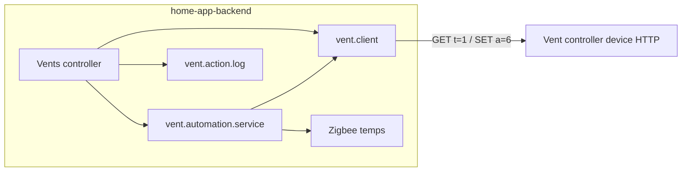

# Vent system — dashboard implementation guide

This document describes how the backend talks to the **vent hardware**, how **automation** and the **action log** work, and how to use the HTTP API to build a **status / control dashboard**. For generic auth and base URL details, see [API.md](./API.md). For **per-room temporary target temperatures** (set/cancel API and extra dashboard fields), see [Vent-Room-Target-API.md](./Vent-Room-Target-API.md).

## Architecture (high level)



1. **`vent.client`** — HTTP client for the physical vent controller (`ventBaseUrl`). Caches the last successful JSON status. Polls are triggered on a timer from `vents.controller.js` and on demand when building the automation dashboard.
2. **`vent.automation.service`** — Reads room temperatures (primarily from the Tasmota Zigbee bridge), compares them to the **controller room** (e.g. stairwell) and setpoints, and opens/closes vents via `vent.client`. Logs each automation action.
3. **`vent.action.log`** — In-memory ring of recent actions with configurable retention (`actionLogRetentionMs`).
4. **`vents.controller.js`** — Express handlers: expose cached status, dashboard + log, and manual position commands.

There is **no WebSocket** for vents; dashboards should **poll** HTTP endpoints.

---

## HTTP API (summary)

All routes require a JWT with normal user permission (see [API.md](./API.md)).

| Method | Path | Purpose |
|--------|------|--------|
| `GET` | `/vents` | Last **cached** raw payload from the vent device (no forced refresh). |
| `GET` | `/vents/actions` | **Refreshes** vent status once, then returns **dashboard** + **action log** (includes optional per-room target override fields on vent-mapped rows; see [Vent-Room-Target-API.md](./Vent-Room-Target-API.md)). |
| `POST` | `/vents/room-target` | JSON: set a **temporary (20h) per-room comfort target** for a `roomVentMap` key, or `{ room, cancel: true }` to clear. |
| `POST` | `/vents/:motorId/:percent` | Set motor `motorId` to `percent` (0–100). Starts a **manual override** window so automation does not fight the user. |

### When to call which endpoint

- **Lightweight tile (positions only):** poll `GET /vents` every 30–60s if raw device JSON is enough.
- **Full dashboard (temps, HVAC mode, “should be open”, statistics, history):** poll `GET /vents/actions` on an interval (e.g. 15–60s). Each call triggers **one** `getVentStatus()` inside `getAutomationDashboard()`, so avoid sub-second polling.

### Manual control

`POST /vents/2/75` sets motor `2` to **75** (clamped and rounded server-side). Successful commands call `recordManualOverride(motorId)` so automation skips that motor until `manualOverrideMs` elapses (from `ventAutomation` config).

**Sample (with token):**

```javascript
async function setVentMotor(baseUrl, token, motorId, percent) {
  const res = await fetch(`${baseUrl}/vents/${motorId}/${percent}`, {
    method: 'POST',
    headers: { Authorization: `Bearer ${token}` },
  });
  const data = await res.json();
  if (!res.ok) throw new Error(data.error || res.statusText);
  return data; // { success, error, status }
}
```

---

## Raw vent device payload (`GET /vents` → `status` field)

The backend does not enforce a single schema beyond what `vent.client` needs. A payload is treated as **usable** if either:

- the root object has a string key `"0"` (motor index) mapping to an object, or  
- `status` is an object containing a motor key (e.g. `"0"`) mapping to an object.

**Per-motor block** (normalized access via `findMotorBlock`):

- Either `payload.status[motorId]` or `payload[motorId]` (string keys: `"0"`, `"1"`, …).
- Fields the automation and dashboard rely on:
  - **`pos`** (number) — position 0–100 (or device-native range; dashboard treats `pos > 0` as “open”).
  - **`name`** (string, optional) — display name for UI.

`GET /vents` returns:

```json
{
  "success": true,
  "error": "",
  "status": { "...": "device JSON or null if never fetched" }
}
```

`status` may be `null` after startup or if the device is unreachable. The server **refreshes** cache every **5 minutes** in the background (`statusInterval` in `vents.controller.js`).

---

## Hardware protocol (reference)

Configured URL base: `appconfig.ventAutomation.ventBaseUrl` (fallback in code: `http://192.168.2.110`).

| Operation | HTTP | Notes |
|-----------|------|--------|
| Read status | `GET {base}/?&t=1` | 8s timeout. JSON body parsed and cached when “usable”. |
| Set position | `GET {base}/?a=6&t=1&m={motorId}&d={padded}` | `d` is **3-digit** zero-padded 0–100 (e.g. `075`). 90s timeout; on some errors the client **polls** until `pos` is near target. |

Dashboard developers normally **do not** call the device directly; use the backend API so cache, overrides, and logs stay consistent.

---

## Dashboard bundle: `GET /vents/actions`

On success, the response merges:

- `actions` — full action log (newest first), same as `ventActionLog.getEntriesNewestFirst()`.
- All fields from `getAutomationDashboard()` (see below).

### Top-level fields (happy path)

| Field | Type | Description |
|-------|------|-------------|
| `success` | boolean | Always `true` for 200 responses from this handler. |
| `error` | string | Empty on success. |
| `actions` | array | See [Action log entries](#action-log-entries). |
| `mode` | string | `'idle'` \| `'cooling'` \| `'heating'` \| `'unknown'` \| `'disabled'`. |
| `automationEnabled` | boolean | From `ventAutomation.enabled`. |
| `controllerTempC` | number \| null | Temperature °C of the **controller room** (e.g. stairwell). |
| `targets` | object \| null | `{ coolTargetC, heatTargetC, roomHysteresisC }`. |
| `rooms` | array | Per-room rows for the table (see below). |
| `lastAutomationEvaluationAt` | number \| null | Epoch ms of last `evaluateAndAct` run while automation was enabled. |
| `statistics` | object \| null | Rollups over the last 24h from the log. |

#### `mode` semantics

Resolved from **controller room** temperature vs. config (not from weather APIs):

- **`disabled`** — automation toggled off.
- **`unknown`** — no valid controller room temperature.
- **`idle`** — `heatTargetC ≤ controllerTempC ≤ coolTargetC` (within band).
- **`cooling`** — controller warmer than `coolTargetC`.
- **`heating`** — controller cooler than `heatTargetC`.

Per-room vent logic uses **hysteresis**: cooling uses `coolTargetC - roomHysteresisC` as the threshold for “room too warm”; heating uses `heatTargetC + roomHysteresisC` for “room too cold”. The dashboard exposes **`wantOpen`** as the automation’s boolean intent for that room in the current mode (or `null` when not applicable).

### `rooms[]` row shape

Each element combines **sensor** data with optional **vent** fields for rooms in `roomVentMap`.

| Field | Type | Description |
|-------|------|-------------|
| `room` | string | Room label (Zigbee name / map key). |
| `temperatureC` | number \| null | Merged Zigbee + optional Wi-Fi supplement. |
| `humidity` | number \| null | When present from sensors. |
| `lastUpdateMs` | number \| null | Last sensor update epoch ms. |
| `temperatureSource` | `"zigbee"` \| `"wifi"` | Wi-Fi supplemental reading wins when ingested for that room. |
| `motorId` | number | Present when room is in `roomVentMap`. |
| `displayName` | string \| null | From device `name` field for that motor. |
| `pos` | number \| null | Current motor position. |
| `isOpen` | boolean | Derived: `pos !== null && pos > 0`. |
| `wantOpen` | boolean \| null | Automation desire in current mode; `null` if mode idle/disabled/unknown or no room temp. |
| `manualOverrideActive` | boolean | True while manual override window is active for this motor. |
| `manualOverrideUntilMs` | number \| null | Epoch ms override expires; `null` if inactive. |
| `roomTargetOverrideC` | number \| null | When present: active **automation** comfort override (°C) for this vent-mapped room; `null` if none. See [Vent-Room-Target-API.md](./Vent-Room-Target-API.md). |
| `roomTargetOverrideUntilMs` | number \| null | When present: epoch ms when that override expires; `null` if inactive. |

Rows are sorted by **`room`** alphabetically. The union of all Zigbee rooms and all `roomVentMap` keys appears, so you may show rooms without vents or vents waiting for first temperature.

### `statistics` (last 24 hours)

| Field | Meaning |
|-------|---------|
| `actionsLast24h` | Total entries in window after retention prune. |
| `automationActionsLast24h` | `source === 'automation'`. |
| `manualActionsLast24h` | `source === 'manual'`. |
| `failedActionsLast24h` | `success === false`. |

### Degraded response

If `getAutomationDashboard()` throws, the handler still returns **200** with `actions` and safe defaults: `mode: 'unknown'`, empty `rooms`, `statistics: null`, etc. The UI should treat that as “dashboard unavailable” while still showing the log.

---

## Action log entries

Each entry (newest first in API):

| Field | Type | Description |
|-------|------|-------------|
| `id` | string | Unique id (`timestamp-seq`). |
| `at` | number | Epoch ms. |
| `source` | `"automation"` \| `"manual"` | |
| `action` | string | `"open"`, `"close"`, or `"set"`. |
| `motorId` | string \| number | |
| `success` | boolean | Hardware command result. |
| `targetRaw` | number (optional) | Commanded 0–100. |
| `roomName` | string (optional) | Usually set for automation. |
| `mode` | `"cooling"` \| `"heating"` (optional) | Automation only. |
| `controllerTempC` | number (optional) | Stairwell / controller temp at action time. |
| `roomTempC` | number (optional) | Room temp at action time. |
| `posBefore` | number (optional) | Position before command. |

Retention: `appconfig.ventAutomation.actionLogRetentionMs` (default **48 hours**).

---

## Configuration (`ventAutomation`)

Relevant keys in `env.config.js` (see `env.config.js.sample`):

| Key | Role |
|-----|------|
| `enabled` | Master switch for automation. |
| `coolTargetC` / `heatTargetC` | Band for **controller** room; outside → cooling/heating mode. |
| `roomHysteresisC` | Per-room threshold slack. |
| `manualOverrideMs` | How long manual API moves block automation for that motor. |
| `controllerRoomName` | Room label used as **controller** temperature (Zigbee map must match). Deprecated alias: `stairwellRoomName`. |
| `ventOpenRaw` / `ventClosedRaw` | Positions automation sends (usually 100 / 0). |
| `roomVentMap` | `{ "Room Name": motorId }` — must align Zigbee room labels with motors. |
| `ventBaseUrl` | HTTP base for `vent.client`. |
| `actionLogRetentionMs` | Log trimming window. |

Changing config requires a **server restart** (config is read from `global.appconfig`).

---

## Dashboard UX hints

1. **Controller strip** — Show `mode`, `controllerTempC`, and `targets` so users understand why vents open or close.
2. **Room table** — Columns: room, temp, humidity, `pos` / `isOpen`, `wantOpen` vs actual (mismatch highlights stuck or manual state), override badge until `manualOverrideUntilMs`.
3. **Activity** — Timeline from `actions`; color by `success` and filter by `source`.
4. **Health** — If `GET /vents` has `status: null` or frequent failures in log, show device offline.
5. **Polling** — Use a single interval; debounce or disable controls while `POST /vent` is in flight. After manual set, prefer a quick follow-up `GET /vents` or `/vents/actions` once 200 returns.

---

## File map (for contributors)

| File | Responsibility |
|------|----------------|
| `devices/controllers/vents.controller.js` | Routes, 5‑minute poll timer |
| `devices/lib/vent.client.js` | HTTP to hardware, cache, motor position helpers |
| `devices/services/vent.automation.service.js` | Dashboard DTO, HVAC logic, overrides |
| `devices/services/vent.action.log.js` | In-memory log + retention |
| `devices/controllers/tasmota.zigbee.controller.js` | Temperatures fed into automation |
